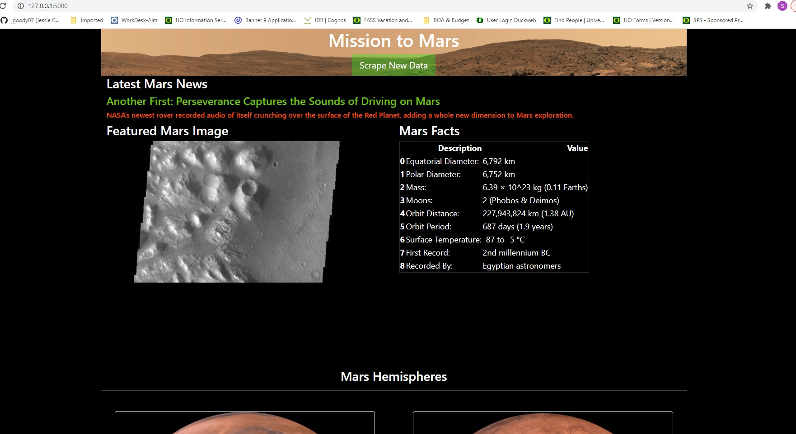
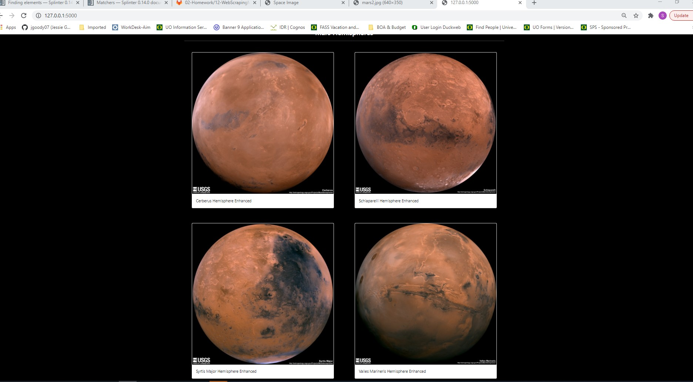

# Web Scrapping Challenge

Build a web application that scrapes various websites for data related to the Mission to Mars and displays the information in a single HTML page.

Scrape from the following sites:

- [NASA Mars News](https://mars.nasa.gov/news/?page=0&per_page=40&order=publish_date+desc%2Ccreated_at+desc&search=&category=19%2C165%2C184%2C204&blank_scope=Latest)
- [JPL Mars Space Images - Featured Image](https://data-class-jpl-space.s3.amazonaws.com/JPL_Space/index.html)
- [Mars Facts](https://space-facts.com/mars/)
- [Mars Hemispheres](https://astrogeology.usgs.gov/search/results?q=hemisphere+enhanced&k1=target&v1=Mars)

## MongoDB and Flask Application

Use MongoDB with Flask templating to create a new HTML page that displays all of the information that was scraped from the URLs above.

Create a template HTML file called index.html that will take the mars data dictionary and display all of the data in the appropriate HTML elements. Make sure your template will display a page even if the data is empty.

